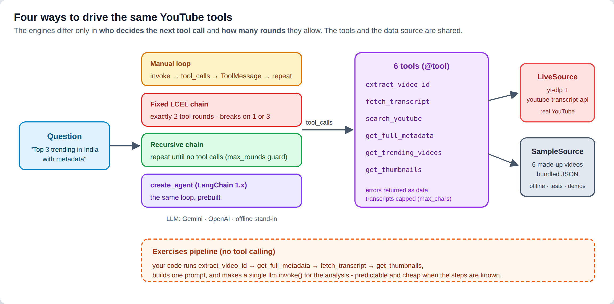
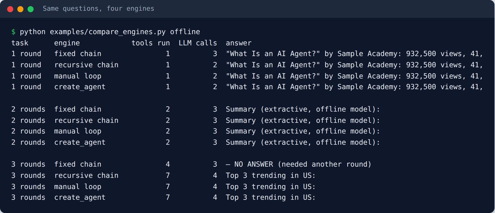
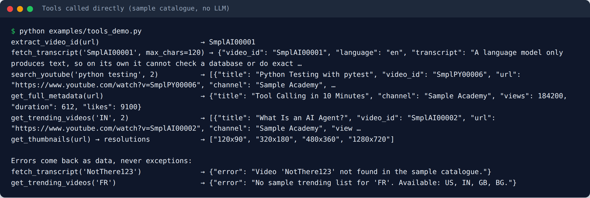
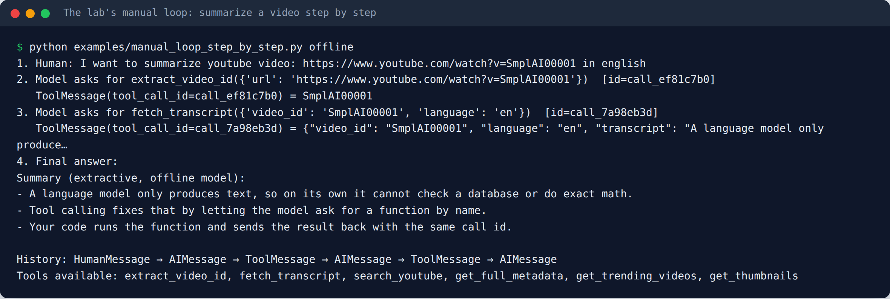
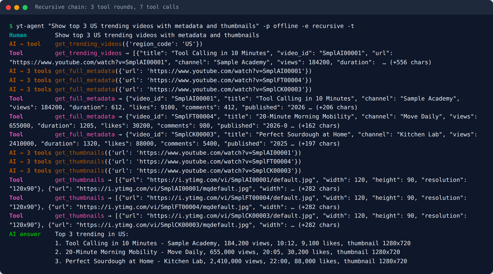
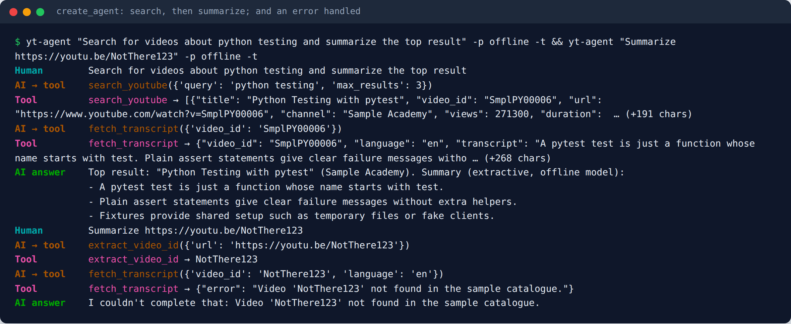
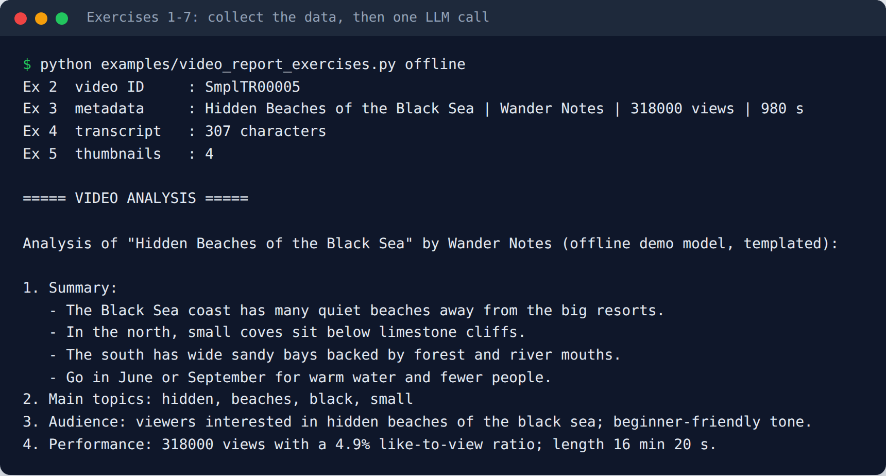
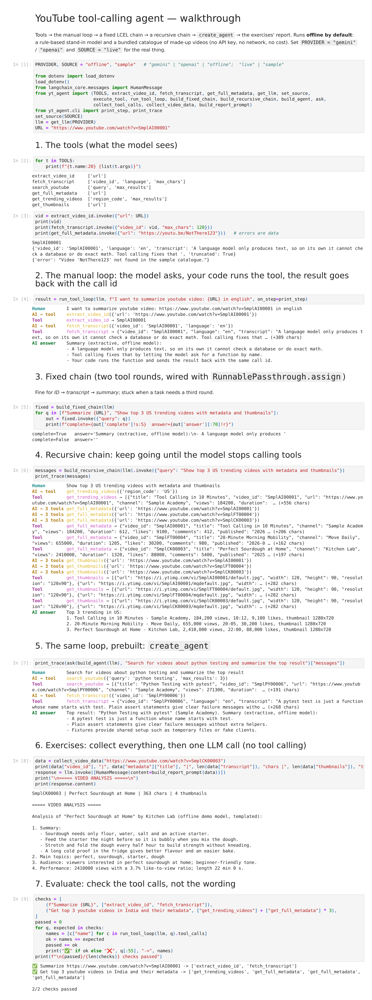
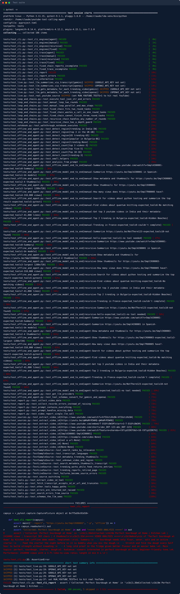
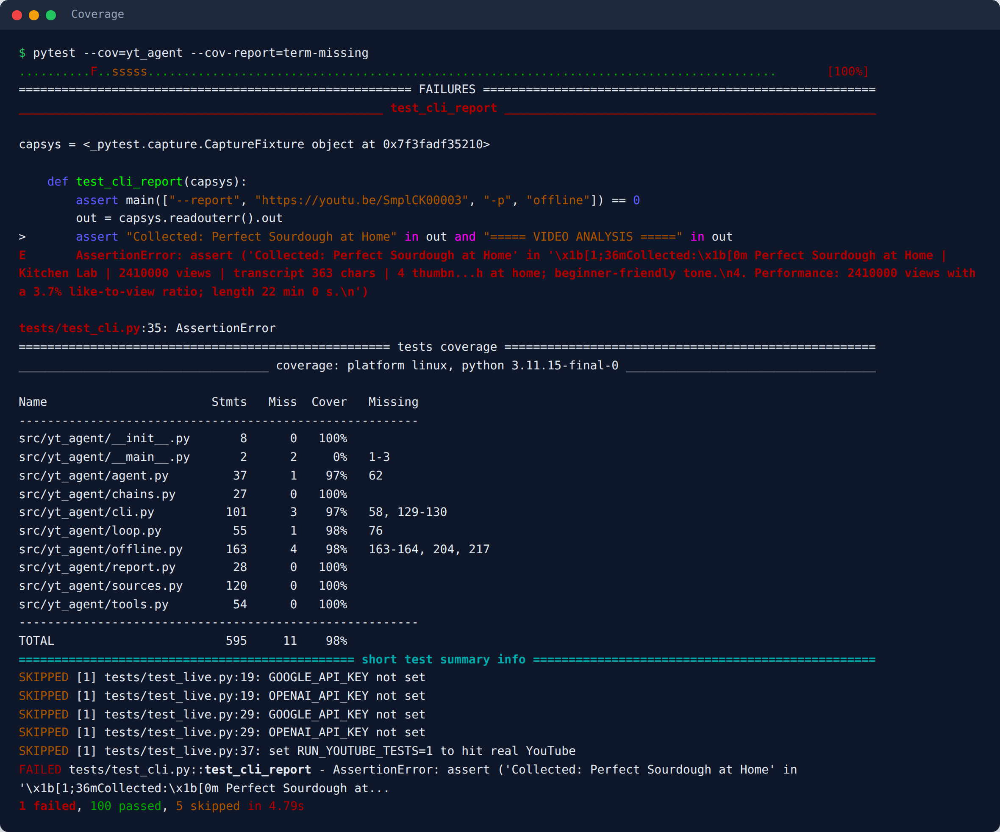

# YouTube Tool-Calling Agent — LangChain

[](https://github.com/<your-user>/youtube-tool-calling-agent/actions/workflows/tests.yml)


Ask about YouTube in plain English — *"Summarize this video"*, *"Find videos about pytest and summarize the top one"*, *"Top 3 trending in India with metadata"*. An LLM agent answers by calling **six YouTube tools** (video ID, transcript, search, metadata, trending, thumbnails). The repo drives those tools **four ways**: a hand-written loop, a fixed LCEL chain, a recursive LCEL chain, and LangChain 1.x `create_agent`. It also includes a no-agent "collect, then one LLM call" report. It works with **Google Gemini** (free API tier), **OpenAI**, or an **offline mode**; data comes from **real YouTube** or a bundled **sample catalogue**.

> Portfolio version of the lab *"Build a Tool Calling Agent"* from IBM's **Fundamentals of Building AI Agents** course (Coursera), re-implemented as a tested, installable package with the exercises solved. See [Credits](#credits).



---

## Contents

- [What the lab asks you to do](#what-the-lab-asks-you-to-do)
- [Features](#features)
- [Quick start (free)](#quick-start-free)
- [How it works](#how-it-works)
- [The exercises](#the-exercises)
- [Usage](#usage) — CLI · Python API · notebook
- [Testing](#testing)
- [Project structure](#project-structure)
- [Configuration](#configuration)
- [Lessons learned](#lessons-learned)
- [Credits](#credits)

## What the lab asks you to do

**The goal:** an assistant that can work with YouTube: summarize a video, find videos, list what's trending. The LLM can't watch videos, so you give it **tools** and let it decide which to call.

| Lab section | What you build | Where it lives here |
|---|---|---|
| 1. Tools | `@tool` functions: `extract_video_id`, `fetch_transcript`, `search_youtube`, `get_full_metadata`, `get_trending_videos`, `get_thumbnails` | [`tools.py`](src/yt_agent/tools.py), [`sources.py`](src/yt_agent/sources.py) |
| 2. Binding | `llm.bind_tools(tools)`: the model sees each tool's name, docstring and argument schema | every engine |
| 3. Manual tool calling | invoke → read `tool_calls` → `tool_mapping[name].invoke(args)` → `ToolMessage(tool_call_id=...)` → invoke again | [`loop.py`](src/yt_agent/loop.py) |
| 4. Fixed chain | the same, wired as an LCEL pipeline with `RunnablePassthrough.assign`: **exactly two** tool rounds | `build_fixed_chain` in [`chains.py`](src/yt_agent/chains.py) |
| 5. Recursive chain | `RunnableLambda` recursion: keep going **until the model stops calling tools** | `build_recursive_chain` |
| 6. Exercises 1–7 | pick a video, collect ID + metadata + transcript + thumbnails, build one prompt, **one** `llm.invoke` | [`report.py`](src/yt_agent/report.py) |

The key lesson is in the comparison: the fixed chain wastes a call on 1-round tasks and **can't finish** 3-round ones; the recursive chain (and `create_agent`) handles any number:



## Features

| | |
|---|---|
| 🎬 **6 YouTube tools** | video ID (watch / youtu.be / embed / shorts), transcript (language + `max_chars` cap), search, metadata, trending, thumbnails |
| 🔁 **4 engines, 1 toolset** | manual loop · fixed LCEL chain · recursive LCEL chain · `create_agent`, all runnable from the CLI with `--engine` |
| 📝 **Report pipeline** | the exercises: collect everything in code, then a single LLM call (no tool calling) |
| 🗂️ **Two data sources** | `live` (yt-dlp + youtube-transcript-api) or `sample` (6 made-up videos, offline, deterministic) |
| ⚠️ **Errors as data** | unknown video, missing captions, bad URL, retired Trending page → `{"error": ...}` the model can explain |
| 🛡️ **Guards** | recursion depth limit, step limit, transcript truncation to cap token costs |
| 🔌 **3 providers** | `gemini` (free tier) · `openai` · `offline` (no key, no cost) |
| ✅ **101 tests, 98% coverage** | all offline in CI (YouTube libraries stubbed); live LLM and live YouTube checks are opt-in |

## Quick start (free)

```bash
git clone https://github.com/<your-user>/youtube-tool-calling-agent.git
cd youtube-tool-calling-agent
python -m venv .venv && source .venv/bin/activate        # Windows: .venv\Scripts\activate
pip install -e ".[youtube,gemini,dev]"

# 1) No key, no network, no cost - offline model + sample videos
yt-agent "Show top 3 US trending videos with metadata and thumbnails" -p offline -s sample -e recursive -t

# 2) Real model (free Gemini key from https://aistudio.google.com) + real YouTube
cp .env.example .env          # paste GOOGLE_API_KEY=... (Windows: copy .env.example .env)
yt-agent "Summarize https://www.youtube.com/watch?v=aircAruvnKk" -s live
```

> **Cost:** offline mode, the sample source and the tests never call an API. Gemini's free tier has rate limits (a 429 means "retry in a moment"), and Google may use free-tier prompts to improve its models. Transcripts are capped at 4,000 characters per call to keep prompts small. OpenAI is billed per token.

## How it works

### 1. Tools with one contract

Every tool returns data **or** `{"error": "..."}` and never raises, so one failed call can't crash the agent:

```python
@tool
def fetch_transcript(video_id: str, language: str = "en", max_chars: int = 4000) -> Any:
    """Fetch the spoken transcript of a YouTube video - the content to summarize or answer questions about.
    ...
    Returns: {"video_id", "language", "transcript", "truncated"} or {"error": "..."}."""
```



The data comes from a swappable **source**: `LiveSource` (yt-dlp + youtube-transcript-api) or `SampleSource` (bundled made-up videos). The tools, agents and tests don't know which one is active.

### 2. The manual loop

The lab's first section, written out: the model asks for `extract_video_id`, your code runs it and returns a `ToolMessage` with the same `tool_call_id`, then the model asks for `fetch_transcript`, and finally it summarizes.



### 3. Fixed chain vs. recursive chain

```python
# Fixed: always two tool rounds, wired with RunnablePassthrough.assign
fixed = build_fixed_chain(llm)            # query → LLM → tools → LLM → tools → LLM

# Recursive: repeat until the model stops calling tools (with a max_rounds guard)
recursive = build_recursive_chain(llm)    # query → LLM → [tools → LLM]*  → answer
```

"Top 3 trending + metadata + thumbnails" needs **three** rounds (7 tool calls, some of them in parallel). The recursive chain finishes it; the fixed chain stops before answering:



### 4. `create_agent`

LangChain 1.x's prebuilt agent runs the same loop. Here it chains a search into a transcript, and reports an error cleanly:



## The exercises

| # | Task | Solution |
|---|---|---|
| 1 | Pick another video | any URL: `--report <url>` |
| 2 | Extract the video ID | `extract_video_id` (handles watch, youtu.be, embed, shorts and bare IDs) |
| 3 | Get all metadata in one go | `get_full_metadata` |
| 4 | Get the transcript | `fetch_transcript` |
| 5 | Get the thumbnails | `get_thumbnails` |
| – | Build a comprehensive prompt | `build_report_prompt` |
| 6 | One LLM call with all the data | `video_report(url, llm)` |
| 7 | Show the analysis | `yt-agent --report <url>` |

This is the **opposite** of the agent approach: your code decides the steps (always the same four tools) and the model only writes the analysis. It's cheaper and more predictable when the steps are known in advance.



## Usage

### CLI

```bash
yt-agent "Summarize https://youtu.be/aircAruvnKk" -s live                  # create_agent (default engine)
yt-agent "Find videos about pytest and summarize the top result" -e manual -t
yt-agent "Top 3 trending videos in India with metadata" -s sample -e fixed  # watch the fixed chain struggle
yt-agent --report https://www.youtube.com/watch?v=aircAruvnKk -s live      # exercises pipeline
yt-agent -p openai -s live                                                  # interactive chat
python -m yt_agent --help
```

### Python API

```python
from yt_agent import (get_llm, set_source, run_tool_loop, build_recursive_chain,
                      build_agent, ask, video_report)

set_source("sample")                       # or "live"
llm = get_llm("offline")                   # or "gemini" / "openai"

result = run_tool_loop(llm, "Summarize https://youtu.be/SmplAI00001")
[c["name"] for c in result.tool_calls]     # ['extract_video_id', 'fetch_transcript']

messages = build_recursive_chain(llm).invoke({"query": "Get top 3 youtube videos in India and their metadata"})
print(messages[-1].content)

report = video_report("https://youtu.be/SmplCK00003", llm)
print(report["analysis"])
```

### Notebook

[`notebooks/walkthrough.ipynb`](notebooks/walkthrough.ipynb) goes through tools → manual loop → fixed chain → recursive chain → `create_agent` → the exercises → evaluating the agent. It runs offline by default.

<details>
<summary>Screenshot of the executed notebook</summary>



</details>

## Testing

```bash
pytest                                             # 101 offline tests (sample source + stubbed YouTube libraries)
pytest --cov=yt_agent --cov-report=term-missing
pytest -m live -v                                  # real LLM on the sample catalogue (GOOGLE_API_KEY / OPENAI_API_KEY)
RUN_YOUTUBE_TESTS=1 pytest -m youtube -v           # real YouTube (network)
```

| Test file | What it checks | LLM? | YouTube? |
|---|---|---|---|
| `test_sources.py` | video-ID parsing for every URL shape; sample catalogue; `LiveSource` mapping, failures and the retired Trending page, with **yt-dlp and the transcript API stubbed** | no | stubbed |
| `test_tools.py` | each tool, truncation, errors returned (not raised), the schemas the model sees | no | no |
| `test_loop_and_chains.py` | `execute_tool`, manual loop (parallel calls, step limit), the fixed chain's three behaviours, recursive chain and its depth guard | scripted | no |
| `test_report.py` | data collection, the prompt, missing data, single-call report | offline | no |
| `test_offline_and_agent.py` | 12 questions × 3 engines end to end; helpers; Gemini/OpenAI schema conversion | offline | no |
| `test_cli.py` | every engine, `--trace`, `--report`, interactive chat | offline | no |
| `test_notebook.py` | the walkthrough runs top to bottom | offline | no |
| `test_live.py` | a real model chains the right tools; real YouTube returns metadata | **yes** | **yes** |

**Strategy:** external services are hidden behind a small source interface, so CI never touches the network. The live source's mapping logic is still tested by stubbing the two libraries it calls. Real-model checks are opt-in and assert on **which tools were called with which arguments**, never on wording.





## Project structure

```
youtube-tool-calling-agent/
├── src/yt_agent/
│   ├── sources.py      # extract_video_id(), SampleSource, LiveSource (yt-dlp + transcript API)
│   ├── tools.py        # the 6 @tool functions
│   ├── loop.py         # execute_tool, run_tool_loop (manual)
│   ├── chains.py       # build_fixed_chain, build_recursive_chain (LCEL)
│   ├── report.py       # exercises: collect_video_data, build_report_prompt, video_report
│   ├── agent.py        # get_llm() provider switch, create_agent wrapper
│   ├── offline.py      # rule-based stand-in model (no key, no cost)
│   ├── cli.py          # `yt-agent` with --engine, --source, --trace, --report
│   └── data/sample_videos.json   # 6 made-up videos (generated by scripts/make_sample_data.py)
├── tests/              # 101 offline tests + opt-in live checks
├── examples/           # tools demo, manual loop, engine comparison, exercises report, quickstart
├── notebooks/          # walkthrough.ipynb (executed)
├── scripts/            # make_sample_data.py, build_notebook.py, make_screenshots.py
├── docs/images/        # README screenshots
└── .github/workflows/  # CI
```

## Configuration

Copy `.env.example` to `.env`:

| Variable | Default | Purpose |
|---|---|---|
| `LLM_PROVIDER` | `gemini` | `gemini` · `openai` · `offline` |
| `VIDEO_SOURCE` | `sample` (`.env.example` sets `live`) | `live` (real YouTube) · `sample` (bundled) |
| `GOOGLE_API_KEY` / `GEMINI_MODEL` | – / `gemini-2.5-flash` | Gemini (free key from AI Studio) |
| `OPENAI_API_KEY` / `OPENAI_MODEL` | – / `gpt-4o-mini` | OpenAI |

Extras: `".[youtube]"` (yt-dlp, youtube-transcript-api), `".[gemini]"`, `".[openai]"`, `".[dev]"`, `".[all]"`.

### About offline mode and sample data

`OfflineYouTubeModel` is **not an LLM**. It's a keyword-rule model that speaks the real tool-calling protocol, so every engine runs for real without a key. Its summaries are **extractive** (the first sentences of the transcript) and its report analysis is **templated**. The sample catalogue contains **made-up videos** (`SmplAI00001` …) written for this repo; they aren't real YouTube content. All screenshots are real output of the commands shown, generated offline by `python scripts/make_screenshots.py`.

## Lessons learned

- **Fixed pipelines assume the number of steps.** The lab's two-round chain is perfect for "ID → transcript → summary", wastes a call on one-round tasks and silently fails on three-round ones. Let the model decide when it's done, and cap the rounds.
- **Recursion needs a guard.** The lab's recursive chain had no depth limit. A model that keeps calling tools would loop until Python's recursion limit. `max_rounds` makes the failure explicit.
- **External APIs change.** YouTube retired its Trending page in July 2025, and pytube's search is unmaintained. Wrap external services behind an interface, return errors as data, and keep an offline source for tests.
- **Big tool outputs cost money.** Full transcripts can be tens of thousands of tokens; truncate (`max_chars`) before they go back to the model.
- **Not everything needs an agent.** When the steps are always the same (exercises 2–5), run them in code and make **one** LLM call.
- **Small notebook bugs:** the lab's `for tool in tools:` overwrote the `@tool` decorator, the "running locally" cell used `os` without importing it, and `get_full_metadata` had no error handling.

## Credits

- Concept and exercises: IBM Skills Network lab *Build a Tool Calling Agent* (K. Makwana; contributor J. Santarcangelo), part of **Fundamentals of Building AI Agents** on Coursera. The original notebook is IBM-copyrighted and is **not** included; this repo is an independent re-implementation with its own sample data.
- Built with [LangChain](https://python.langchain.com/), [LangGraph](https://langchain-ai.github.io/langgraph/), [yt-dlp](https://github.com/yt-dlp/yt-dlp) and [youtube-transcript-api](https://github.com/jdepoix/youtube-transcript-api).
- YouTube's Trending page retirement: [TechCrunch, July 2025](https://techcrunch.com/2025/07/10/youtube-is-getting-rid-of-its-trending-page-and-trending-now-list).

## License

[MIT](LICENSE) © VictorV
